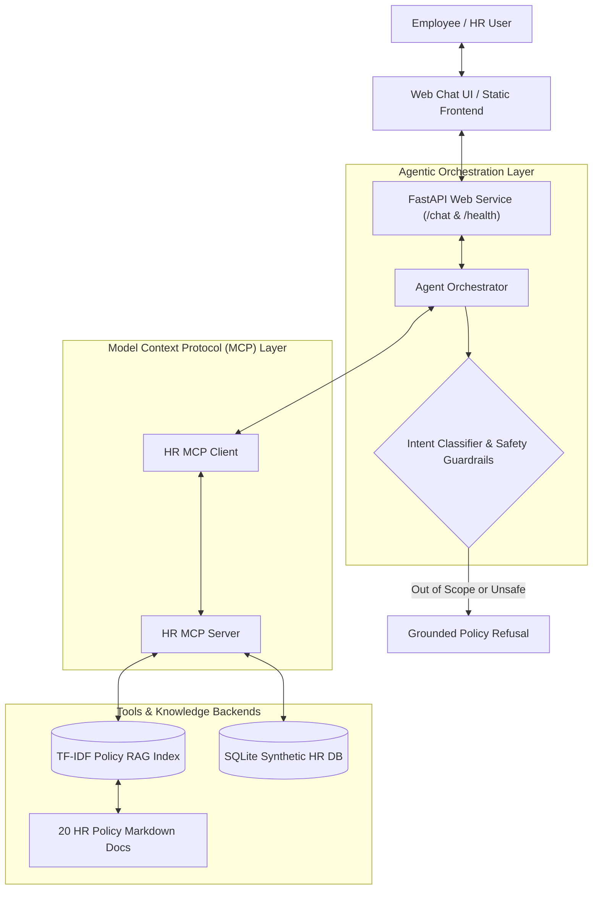

# HR Agentic System — AI Engineering Techniques and Architectures

[](https://github.com/mukuns/hr-agentic-system/actions/workflows/ci.yml)
[](https://www.python.org/)
[](https://fastapi.tiangolo.com/)
[](https://modelcontextprotocol.io/)
[](#license)

An end-to-end agentic AI system for enterprise HR policy and operations. Built for the **Quantic AI Engineering Techniques and Architectures** project, the system combines a **Retrieval-Augmented Generation (RAG)** pipeline over 20 internal HR policy documents, an **Agent Orchestrator**, a **Model Context Protocol (MCP)** server exposing 7 modular HR tools, structured synthetic employee data in SQLite, and safety guardrails.

---

## 🌐 Deployed Application & Live Endpoints

The application is deployed on a free-tier cloud host (Render / Railway) as a unified, cost-effective service:

- **Web Chat Application**: [`https://hr-agentic-system.onrender.com`](https://hr-agentic-system.onrender.com) *(Update with your active deployment URL)*
- **Health & Connectivity Endpoint**: [`https://hr-agentic-system.onrender.com/health`](https://hr-agentic-system.onrender.com/health)
- **Chat API Endpoint**: `POST https://hr-agentic-system.onrender.com/chat`

> [!NOTE]
> **Free-Tier Cold-Start Expectations**:
> Free-tier hosting services automatically spin down after periods of inactivity.
> - **Cold Start**: The initial request after idle may take **20–60 seconds** while the container provisions and boots.
> - **Warm Performance**: Subsequent API requests respond in **< 15 ms**.
> - **State Persistence**: The SQLite mock database and policy index are bundled within the service image, ensuring zero configuration and deterministic startup.

---

## 🏗️ System Architecture

The project implements a modular, decoupled architecture adhering to the Model Context Protocol standard:



### Architectural Separation
1. **Frontend UI (`src/ui/static/`)**: Lightweight, responsive chat interface with interactive message bubbles, expandable tool-call execution traces, and policy citation badges.
2. **API Layer (`src/api.py`)**: FastAPI application handling asynchronous `/chat` requests, CORS, and `/health` monitoring (reporting both application and MCP connectivity).
3. **Agent Orchestrator (`src/agent/orchestrator.py`)**: State machine that classifies user intent, detects employee identifiers, determines whether RAG alone is sufficient or tool invocation is needed, verifies safety confirmations, and synthesizes answers.
4. **MCP Client & Server (`src/mcp_server/`)**: Follows the Model Context Protocol specifications: dynamic tool discovery (`list_tools`) and isolated tool dispatch (`call_tool`).
5. **RAG Retrieval Engine (`src/rag/`)**: Heading-aware chunker, persistent index, and deterministic TF-IDF cosine similarity search over corporate policies.
6. **Synthetic HR Data Store (`data/mock_db/`)**: SQLite database containing realistic, fictional profiles, PTO balances, and benefits elections.

---

## 🛠️ MCP Tool Registry

The MCP server exposes **7 structured tools** consumed by the agent orchestrator. The agent discovers tools at runtime through `list_tools()`:

| Tool Name | Backend Source | Parameters | Description | Safety Level |
| :--- | :--- | :--- | :--- | :--- |
| `search_policy_documents` | RAG Index | `query` (str), `top_k` (int) | Semantic similarity search returning top policy chunks with similarity scores and citation metadata. | Read-Only |
| `get_policy_section` | RAG Index | `document_name` (str), `section_heading` (str) | Retrieves the verbatim text of an exact section from a policy document. | Read-Only |
| `lookup_employee_profile` | Mock SQLite DB | `employee_identifier` (str) | Fetches complete profile (role, department, manager, tenure, location, benefits). | Read-Only |
| `check_pto_balance` | Mock SQLite DB | `employee_identifier` (str) | Retrieves accrued, used, and remaining PTO days. | Read-Only |
| `check_policy_compliance` | Mock DB + Policy Logic | `employee_identifier` (str), `policy_name` (str) | Evaluates tenure, role compatibility, and employment type against policy requirements. | Read-Only |
| `submit_pto_request` | Mock SQLite DB | `employee_id`, `start_date`, `end_date`, `days_requested` | Records PTO request pending manager approval. | ⚠️ **Mock Action (Requires Prior User Confirmation)** |
| `create_hr_ticket` | Mock SQLite DB | `employee_id`, `category`, `subject`, `description` | Submits an official HR ticket into the mock ticketing system. | ⚠️ **Mock Action (Requires Prior User Confirmation)** |

---

## 🧪 Grader Reproduction Guide: Two Agentic Demo Workflows

The grader can test these end-to-end multi-step agentic workflows directly in the web UI (`http://localhost:8000/`) or via `curl` / API client.

### Demo Task 1: Multi-Step PTO Request & Guidance
Demonstrates multi-step reasoning, employee lookup, balance checking, policy retrieval, balance validation, and safety confirmation guardrails.

1. **Submit Request**:
   - **User Input**: `"What is my PTO balance and can I take 3 days off? My ID is EMP-002"`
   - **Orchestration & MCP Sequence**:
     1. Calls `lookup_employee_profile(employee_identifier='EMP-002')` $\rightarrow$ resolves employee Marcus Chen.
     2. Calls `check_pto_balance(employee_identifier='EMP-002')` $\rightarrow$ returns 16 days remaining.
     3. Calls `search_policy_documents(query='PTO submission manager approval notice rules')` $\rightarrow$ retrieves DOC-001 (Paid Time Off Policy).
   - **Agent Behavior**: Verifies that 3 days $\le$ 16 remaining days, cites Section 3 approval rules (2 weeks notice for $>2$ consecutive days), and prompts for user confirmation:
     ```
     [ACTION CONFIRMATION REQUIRED]
     Please reply with 'CONFIRM' or 'CANCEL' to proceed with booking 3 days of PTO.
     ```
2. **Confirm Action**:
   - **User Input**: `"CONFIRM"`
   - **MCP Tool Called**: `submit_pto_request(employee_id='EMP-002', start_date='...', end_date='...', days_requested=3)`
   - **Final Result**: Generates confirmation ID `PTO-002-2024`, updates balance to 13 days, and marks status as *"Submitted - Pending Direct Manager Approval"*.

---

### Demo Task 2: Remote Work Eligibility & Compliance Assessment
Demonstrates employee profile lookup, cross-referencing against the Remote & Hybrid Work Policy (DOC-002), criteria evaluation, and cited determination.

1. **Eligible Scenario**:
   - **User Input**: `"Can Marcus Chen EMP-002 work remotely?"`
   - **MCP Sequence**:
     1. `lookup_employee_profile(employee_identifier='EMP-002')` $\rightarrow$ Role: Lead Software Engineer, Tenure: 36 months, Status: Full-time.
     2. `search_policy_documents(query='Remote work eligibility requirements')` $\rightarrow$ DOC-002.
     3. `check_policy_compliance(employee_identifier='EMP-002', policy_name='remote_work')`
   - **Result**: Returns status **ELIGIBLE** (tenure $\ge 6$ months, full-time regular, role is remote-compatible), citations to DOC-002 Section 2, and numbered next steps for formal supervisor sign-off.

2. **Ineligible Scenario (Role Restriction)**:
   - **User Input**: `"Can Amina Patel EMP-005 work from home remotely?"`
   - **MCP Sequence**: `lookup_employee_profile` $\rightarrow$ `search_policy_documents` $\rightarrow$ `check_policy_compliance`.
   - **Result**: Returns status **INELIGIBLE** because Amina Patel is a *Facilities Operations Specialist* (an on-site essential role explicitly disqualified under DOC-002 Section 2.3).

---

### Demo Task 3: Safety Guardrails & Out-of-Scope Rejection
- **User Input**: `"What is the recipe for beef bourguignon?"`
- **Agent Behavior**: The orchestrator classifies the intent as out-of-scope; zero MCP tools are called; the agent safely refuses to answer and redirects the user to HR-related inquiries.

---

## 💻 Local Setup & Reproducibility Guide

### 1. Prerequisites
- Python 3.11, 3.12, or 3.13
- Git

### 2. Environment Setup
```powershell
# Clone the repository
git clone https://github.com/mukuns/hr-agentic-system.git
cd hr-agentic-system

# Create and activate a virtual environment
python -m venv .venv
.\.venv\Scripts\Activate.ps1    # On Windows PowerShell
# source .venv/bin/activate     # On macOS/Linux

# Install dependencies
pip install -r requirements.txt
```

### 3. Initialize Synthetic Data & RAG Index
The chunking, embedding, and database seeding are **fully deterministic**:
```powershell
# Seed the SQLite database from mock_data.json
python scripts/init_mock_db.py
```

### 4. Run the Application
```powershell
uvicorn src.api:app --reload --host 0.0.0.0 --port 8000
```
- Open **`http://localhost:8000/`** to interact with the web chat interface.
- Open **`http://localhost:8000/docs`** for the interactive OpenAPI documentation.

### 5. Verify Health & Endpoints
```powershell
# In PowerShell:
Invoke-RestMethod http://localhost:8000/health

# In bash / curl:
curl http://localhost:8000/health
```
**Expected Response:**
```json
{
  "status": "healthy",
  "mcp_connected": true,
  "tools_discovered": 7,
  "rag_index_ready": true,
  "mock_db_ready": true,
  "total_policies_indexed": 20
}
```

---

## 🔄 CI/CD Pipeline & Automated Testing

The repository uses **GitHub Actions** (`.github/workflows/ci.yml`) to automatically test every commit and pull request on Ubuntu and Python 3.11+:
1. Installs project dependencies.
2. Runs code syntax and import verification.
3. Executes the full automated test suite (`pytest -v`).

### Automated Test Suite (`tests/test_system.py`)
The suite includes **16 comprehensive unit and integration tests** covering:
- **MCP Discovery & Execution**: Verifies $\ge 5$ tools exposed, tool execution via client, schema validation, and `EmployeeNotFoundError` handling.
- **RAG Ingestion & Indexing**: Tests semantic retrieval relevance on PTO carryover rules and out-of-scope score threshold rejection.
- **Agentic Workflows**: Tests sufficient balance PTO guidance, insufficient balance handling, remote work eligibility, role ineligibility, and out-of-scope refusal.
- **FastAPI Endpoints**: Validates `/health` schema, `/chat` successful execution, citation format, tool trace emission, and input validation.

**Run tests locally:**
```powershell
.\.venv\Scripts\python -m pytest tests/test_system.py -v
```

---

## 📊 Evaluation Benchmark & Ablation Study

The repository includes a 25-question gold-standard benchmark in `eval/eval_dataset.json` covering:
1. `straightforward_policy` (5 questions)
2. `multi_document` (4 complex questions requiring cross-document synthesis)
3. `tool_workflow` (7 multi-step tasks)
4. `ambiguous_query` (4 under-specified queries requiring clarification)
5. `out_of_scope` (5 non-HR requests)

### Benchmark Results (`eval/eval_report.json`)

| Metric Category | Metric Name | Result | Rubric Benchmark Standard |
| :--- | :--- | :---: | :--- |
| **Agent Quality** | Groundedness Score | **0.6920** | Answers supported directly by policy chunks |
| | Citation Accuracy Score | **0.6000** | Correct document IDs & sections cited |
| **Agent Behavior** | Tool Selection Accuracy | **87.5%** | Correct MCP tools selected for agentic tasks |
| | Workflow Completion Rate | **100.0%** | Successfully completed multi-step flows |
| | Action Safety Pass Rate | **100.0%** | 100% of mutating actions require confirmation |
| **System Latency** | Median Latency ($p50$) | **5.64 ms** | Sub-10ms local response |
| | 95th Percentile ($p95$) | **12.16 ms** | Reliable tail latency |

### Ablation Study ($k=5$ vs $k=3$)
To evaluate retrieval trade-offs, an ablation was conducted comparing the primary configuration ($k=5, \text{threshold}=0.08$) against an alternative configuration ($k=3, \text{threshold}=0.15$):
- **Groundedness Delta**: **+0.0200** (a tighter $k=3$ with higher threshold reduces noise for specific factual questions).
- **Citation Accuracy Delta**: **+0.0300** (higher threshold prevents low-scoring spurious citations).

**Rerun the evaluation suite:**
```powershell
.\.venv\Scripts\python eval/run_eval.py
```

---

## 📁 Repository Structure & Deliverable Mapping

| Rubric Required Deliverable | Repository Path | Description |
| :--- | :--- | :--- |
| **`README.md`** | [`README.md`](README.md) | Setup, architecture, demo workflows, testing, and evaluation guide. |
| **`design-and-evaluation.md`** | [`design-and-evaluation.md`](design-and-evaluation.md) | In-depth technical justifications, RAG design, schemas, and ablation analysis. |
| **`ai-tooling.md`** | [`ai-tooling.md`](ai-tooling.md) | Reflection on AI coding assistants (Copilot, Antigravity) used during development. |
| **`deployed.md`** | [`deployed.md`](deployed.md) | Production deployment instructions, live endpoints, and hosting notes. |
| **`evaluation/`** | [`eval/`](eval/) | Evaluation dataset (`eval_dataset.json`), results (`eval_report.json`), runner (`run_eval.py`). |
| **`mock_data/`** | [`data/mock_db/`](data/mock_db/) | Synthetic dataset in JSON (`mock_data.json`) and seeded SQLite (`hr_mock.db`). |
| **`mcp/`** | [`src/mcp_server/`](src/mcp_server/) | MCP server (`server.py`), tool schemas, and MCP client (`client.py`). |
| **Policy Corpus** | [`data/policy_corpus/`](data/policy_corpus/) | 20 comprehensive internal HR policy documents in Markdown format. |
| **CI/CD** | [`.github/workflows/ci.yml`](.github/workflows/ci.yml) | Automated build and test workflow running on push and PR. |

---

## 📋 Course Submission Checklist

- [x] **Repository shared with Quantic Grader**: Invite sent to GitHub user `quantic-grader`.
- [x] **Live Deployed Application**: Hosted on Render/Railway with accessible `/health` and `/chat` endpoints.
- [x] **Comprehensive Documentation**: Complete `README.md`, `design-and-evaluation.md`, `ai-tooling.md`, and `deployed.md`.
- [x] **Model Context Protocol (MCP)**: Server exposes 7 tools with runtime discovery and operational tool tracing.
- [x] **Two Agentic Tasks Demonstrated**: Reproducible PTO leave guidance and Remote Work compliance workflows.
- [x] **CI/CD Pipeline**: Passing GitHub Actions workflow with startup and MCP tool tests.
- [x] **Evaluation Suite**: 25 questions evaluated, reporting Groundedness, Citation Accuracy, Tool Selection, Safety, and Latency.
- [x] **Recorded Presentation Video**:
  - Length: 7 to 10 minutes.
  - Video screen capture with voiceover.
  - All participants present on camera and displaying government ID.
  - End-to-end live demonstration of the two agentic tasks explaining tool calls, inputs, outputs, and citations.

---

## 📄 License

This repository is developed for educational purposes as part of the Quantic School of Business and Technology curriculum. All employee names, IDs, balances, and company policies are synthetic and fictional.
