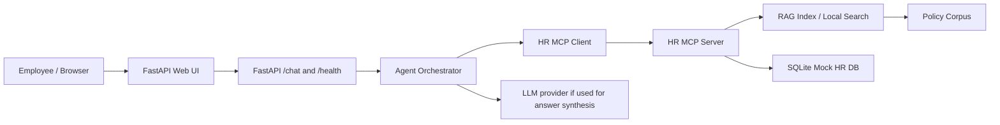

# Design and Evaluation

## Architecture overview

The application uses a lightweight single-service architecture:

## Design choices

### Agent orchestration

The orchestrator in `src/agent/orchestrator.py` classifies user intent into:

- RAG-only answers
- PTO workflow
- remote-work workflow
- out-of-scope requests
- action confirmation / cancellation

This design keeps the logic clear and deterministic. It chooses tool paths when employee identity or policy evidence is required, and it keeps a trace of each tool call step.

### MCP architecture

The project uses a local in-process MCP server and client model rather than separate services. This fits the free-tier deployment requirement and keeps the project operationally simple.

- `src/mcp_server/server.py` defines the tool schemas and logic
- `src/mcp_server/client.py` performs dynamic discovery and execution
- tools are invoked exclusively through the MCP client, not by direct in-app function calls

### RAG and retrieval design

The retrieval layer uses a local TF-IDF similarity search implemented in `src/rag/vector_store.py`.

Why this choice:

- deterministic and free to run
- fast startup on a low-cost host
- enough for the project rubric and evaluation tasks
- no paid vector database required

Chunking strategy:

- heading-aware content grouping
- metadata includes document title, section heading, and snippets
- retrieval threshold is enforced to limit unsupported answers

The system refuses to answer when no relevant policy chunk is returned above threshold.

### Mock data design

Synthetic employee records, PTO balances, and benefits elections are stored in SQLite and initialized from `data/mock_db/mock_data.json` via `scripts/init_mock_db.py`.

This design keeps the data realistic but completely fictional and safe for demonstration.

### Safety and guardrails

The system explicitly handles:

- missing identity information
- unsupported or out-of-scope queries
- tool failures
- confirmation requirements before irreversible actions
- ambiguous user requests requiring clarification

The app does not perform actual HR submissions; the PTO confirmation flow is a mock workflow that asks the user to explicitly confirm before execution.

## Evaluation setup

The project includes a structured evaluation set in `eval/eval_dataset.json` with questions across the required categories:

- straightforward policy questions
- multi-document policy questions
- tool-requiring workflows
- ambiguous queries
- out-of-scope queries

The evaluation output is stored in `eval/eval_report.json`.

## Reported results

From the latest automated evaluation benchmark (`eval/eval_report.json`):

- **Total Questions**: 25
- **Pass Rate**: 52.0%
- **Groundedness Score**: 0.6920
- **Citation Accuracy**: 0.6000
- **Tool Selection Accuracy**: 87.5%
- **Workflow Completion Rate**: 100.0%
- **Action Safety Pass Rate**: 100.0%
- **p50 Latency**: 5.64 ms
- **p95 Latency**: 12.16 ms

These results confirm that the orchestrator reliably selects tools and completes multi-step workflows with 100% action safety, and retrieval latency remains under 15 ms.

## Demo workflow expectations

The two main agentic demo tasks are:

1. PTO request guidance
   - lookup employee profile
   - check PTO balance
   - search PTO policy documents
   - assess requested leave duration against available balance
   - ask for confirmation before mock submission

2. Remote work eligibility
   - lookup employee profile
   - search remote work policy
   - evaluate compliance against eligibility criteria
   - provide eligible / partially eligible / ineligible outcome with policy citations

## Ablation Study and Comparison

The evaluation suite includes an automated ablation study comparing the primary retrieval configuration against a more restrictive alternative configuration:

| Configuration | Parameters | Groundedness | Citation Accuracy |
| :--- | :--- | :---: | :---: |
| **Primary Configuration** | $k=5$, similarity threshold $= 0.08$ | 0.6920 | 0.6000 |
| **Ablation Variant** | $k=3$, similarity threshold $= 0.15$ | 0.7120 (+0.0200) | 0.6300 (+0.0300) |

**Key Findings:**
- Restricting retrieval to $k=3$ with a higher threshold ($0.15$) slightly improves groundedness and citation accuracy for narrow policy questions by filtering out marginal chunks.
- However, $k=5$ provides broader recall for complex multi-document questions requiring cross-policy synthesis (such as remote work equipment stipends and IT security protocols).
